**`!`**
> run `firefox-custom.sh` after the first launch of regular Firefox
>
> `ly.sh` might not work as you expected
> 
> `display.sh` and `cursor.sh` do not run in TTY

```mermaid
graph TD;
    style bspwmrc fill:#161b22,stroke:#20232a,stroke-width:2px,rx:5,ry:5;
    style sxhkdrc fill:#161b22,stroke:#20232a,stroke-width:2px,rx:5,ry:5;
    style alacritty_toml fill:#161b22,stroke:#20232a,stroke-width:2px,rx:5,ry:5;
    style xsession fill:#161b22,stroke:#20232a,stroke-width:2px,rx:5,ry:5;
    style bspwm_config fill:#161b22,stroke:#20232a,stroke-width:2px,rx:5,ry:5;
    style alacritty_config fill:#161b22,stroke:#20232a,stroke-width:2px,rx:5,ry:5;
    style home fill:#161b22,stroke:#20232a,stroke-width:2px,rx:5,ry:5;

    bspwmrc["$HOME/bspwm/dotfiles/bspwmrc"] --> bspwm_config["$HOME/.config/bspwm"]
    sxhkdrc["$HOME/bspwm/dotfiles/sxhkdrc"] --> bspwm_config
    alacritty_toml["$HOME/bspwm/dotfiles/alacritty.toml"] --> alacritty_config["$HOME/.config/alacritty"]
    xsession["$HOME/bspwm/dotfiles/.xsession"] --> home["$HOME/"]
```




```stl
solid star
  facet normal 0 0 0
    outer loop
      vertex 0 0 0
      vertex 1 3 0
      vertex 2 0 0
    endloop
  endfacet
  facet normal 0 0 0
    outer loop
      vertex 2 0 0
      vertex 3 3 0
      vertex 4 0 0
    endloop
  endfacet
  facet normal 0 0 0
    outer loop
      vertex 4 0 0
      vertex 5 3 0
      vertex 6 0 0
    endloop
  endfacet
  facet normal 0 0 0
    outer loop
      vertex 6 0 0
      vertex 7 3 0
      vertex 8 0 0
    endloop
  endfacet
  facet normal 0 0 0
    outer loop
      vertex 8 0 0
      vertex 9 3 0
      vertex 10 0 0
    endloop
  endfacet
endsolid star
```
