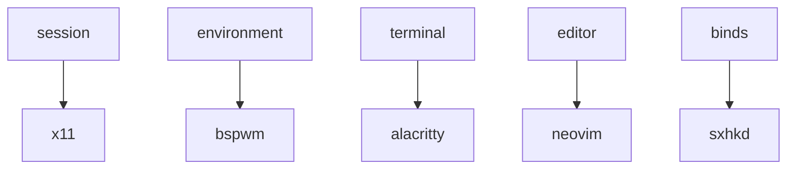

```mermaid
graph TD;
    session-->x11;
    environment-->bspwm;
    terminal-->alacritty;
    editor-->neovim;
    binds-->sxhkd;
```

```bash
gnome-keyring-daemon --start --components=secrets
```

[Cursor](dotfiles/cursors/Nordzy-cursors-white.tar.gz) - [Source Code](https://github.com/guillaumeboehm/Nordzy-cursors)
