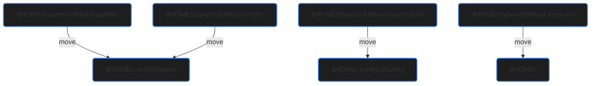

**`!`**
> run `firefox-custom.sh` after the first launch of regular Firefox
>
> `ly.sh` might not work as you expected
> 
> `display.sh` and `cursor.sh` do not run in TTY



```mermaid
graph TD;
    style bspwmrc fill:#1e1e1e,stroke:#3b82f6,stroke-width:2px,rx:5,ry:5;
    style sxhkdrc fill:#1e1e1e,stroke:#3b82f6,stroke-width:2px,rx:5,ry:5;
    style alacritty_toml fill:#1e1e1e,stroke:#3b82f6,stroke-width:2px,rx:5,ry:5;
    style xsession fill:#1e1e1e,stroke:#3b82f6,stroke-width:2px,rx:5,ry:5;
    style bspwm_config fill:#1e1e1e,stroke:#3b82f6,stroke-width:2px,rx:5,ry:5;
    style alacritty_config fill:#1e1e1e,stroke:#3b82f6,stroke-width:2px,rx:5,ry:5;
    style home fill:#1e1e1e,stroke:#3b82f6,stroke-width:2px,rx:5,ry:5;

    bspwmrc["$HOME/bspwm/dotfiles/bspwmrc"] -->|move| bspwm_config["$HOME/.config/bspwm"]
    sxhkdrc["$HOME/bspwm/dotfiles/sxhkdrc"] -->|move| bspwm_config
    alacritty_toml["$HOME/bspwm/dotfiles/alacritty.toml"] -->|move| alacritty_config["$HOME/.config/alacritty"]
    xsession["$HOME/bspwm/dotfiles/.xsession"] -->|move| home["$HOME/"]
```

```stl

```
